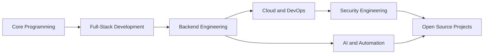

<div align="center">


<a href="https://git.io/typing-svg">
  
</a>

<br />


</div>

---

## About Me

I am **MSP**, a software development enthusiast from India focused on becoming an elite software engineer and cybersecurity professional.

I enjoy building useful software, learning modern engineering practices, exploring secure systems, and turning ideas into practical projects. My interests span full-stack development, backend engineering, automation, cloud computing, Linux, DevOps, AI, and cybersecurity research.

I believe in clean code, consistent learning, strong fundamentals, and sharing knowledge through projects.

```txt
Current direction
> Build real-world software
> Learn deeply, practice consistently
> Improve as a full-stack engineer
> Grow in cybersecurity, cloud, AI, and open source
```

---

## Current Focus

<table>
  <tr>
    <td width="50%">
      <h3>Engineering</h3>
      <ul>
        <li>C# and .NET application development</li>
        <li>ASP.NET Core APIs and backend architecture</li>
        <li>Python automation and practical tools</li>
        <li>Java, JavaScript, TypeScript, and full-stack apps</li>
        <li>Clean code, debugging, testing, and maintainability</li>
      </ul>
    </td>
    <td width="50%">
      <h3>Security, AI, and Cloud</h3>
      <ul>
        <li>Cybersecurity fundamentals and ethical hacking labs</li>
        <li>Linux, networking, and reverse engineering for research</li>
        <li>AI and machine learning project exploration</li>
        <li>AWS, Docker, Kubernetes, and DevOps workflows</li>
        <li>Open source learning and project-based growth</li>
      </ul>
    </td>
  </tr>
</table>

---

## Tech Stack

### Languages

<p>
  
</p>


### Frameworks and Platforms

<p>
  
</p>


### Databases

<p>
  
</p>


### Tools

<p>
  
</p>


---

## Featured Interests

<table>
  <tr>
    <td align="center" width="25%">
      
      <br />
      APIs, services, databases, clean architecture
    </td>
    <td align="center" width="25%">
      
      <br />
      Ethical hacking, Linux, networking, secure systems
    </td>
    <td align="center" width="25%">
      
      <br />
      Automation, intelligent tools, applied learning
    </td>
    <td align="center" width="25%">
      
      <br />
      AWS, Docker, Kubernetes, CI/CD workflows
    </td>
  </tr>
</table>

---

## Learning Roadmap



### Currently Learning

- Advanced C# and .NET development
- ASP.NET Core Web APIs and backend system design
- Python automation and scripting
- Java, React, Node.js, Express, and TypeScript
- AWS fundamentals, Docker, Kubernetes, and GitHub Actions
- Linux, networking, cybersecurity fundamentals, ethical hacking, and reverse engineering for learning and research
- AI and machine learning concepts through hands-on projects

---

## Project Ideas and Repository Roadmap

These repositories would strengthen the profile and show practical ability across software engineering, security, cloud, AI, and open source.

| Repository | Purpose | Suggested Stack |
|---|---|---|
| `msp-portfolio` | Personal portfolio website with projects, resume, and contact section | React, TypeScript, Tailwind CSS |
| `aspnet-core-api-lab` | Clean REST API with authentication, database, tests, and documentation | C#, ASP.NET Core, PostgreSQL |
| `dotnet-desktop-tools` | Practical Windows utilities and desktop apps | C#, .NET, WPF or WinUI |
| `python-automation-suite` | Scripts for files, APIs, scraping, reports, and developer productivity | Python, Requests, Typer |
| `ai-mini-projects` | Small AI and ML experiments with notebooks and apps | Python, scikit-learn, FastAPI |
| `fullstack-web-apps` | Real-world full-stack applications | React, Node.js, Express, MongoDB |
| `docker-devops-labs` | Dockerized apps, compose files, CI/CD examples | Docker, GitHub Actions |
| `kubernetes-learning-labs` | Kubernetes manifests, deployments, services, ingress examples | Kubernetes, YAML |
| `aws-cloud-labs` | Cloud learning projects and deployment notes | AWS, Terraform optional |
| `linux-admin-scripts` | Linux Bash scripts for automation and system tasks | Bash, Linux |
| `networking-tools` | Learning-focused tools for networking fundamentals | Python, sockets |
| `security-learning-labs` | Legal cybersecurity labs, notes, checklists, and writeups | Linux, Python, Markdown |
| `reverse-engineering-notes` | Research-only reverse engineering notes and safe toy examples | C, Assembly notes, Ghidra notes |
| `android-app-lab` | Android and mobile app experiments | Flutter, Dart |
| `open-source-contributions` | Contributions, issue notes, PR summaries, learning logs | Markdown |

---

## GitHub Analytics

<div align="center">


<br />
<br />


<br />
<br />


<br />
<br />


<br />
<br />


</div>

---

## Achievement Board

<div align="center">


</div>

---

## Contribution Snake

<div align="center">

<picture>
  <source media="(prefers-color-scheme: dark)" srcset="https://raw.githubusercontent.com/MSPYADAV/MSPYADAV/output/github-contribution-grid-snake-dark.svg" />
  <source media="(prefers-color-scheme: light)" srcset="https://raw.githubusercontent.com/MSPYADAV/MSPYADAV/output/github-contribution-grid-snake.svg" />
  
</picture>

</div>

---

## Principles

```txt
Clean code over clever code
Consistency over intensity
Projects over passive learning
Security mindset by default
Documentation as part of engineering
```

---

## Fun Facts

- I enjoy learning new programming languages, frameworks, operating systems, and security concepts.
- I like building practical tools that save time or solve real problems.
- I am interested in both software engineering depth and cybersecurity fundamentals.
- I treat every project as a chance to improve code quality, design, documentation, and deployment.

---

## Connect

<div align="center">

<a href="https://github.com/MSPYADAV">
  
</a>

</div>

---

## Support

If my projects help you learn or build something useful, consider supporting them by:

- Starring useful repositories
- Opening issues with clear feedback
- Sharing ideas for improvement
- Contributing documentation, examples, or fixes
- Connecting for open source collaboration

---

<div align="center">


<strong>MSP</strong>
<br />
Software Development | Cybersecurity Learning | AI | Cloud | Open Source

</div>
